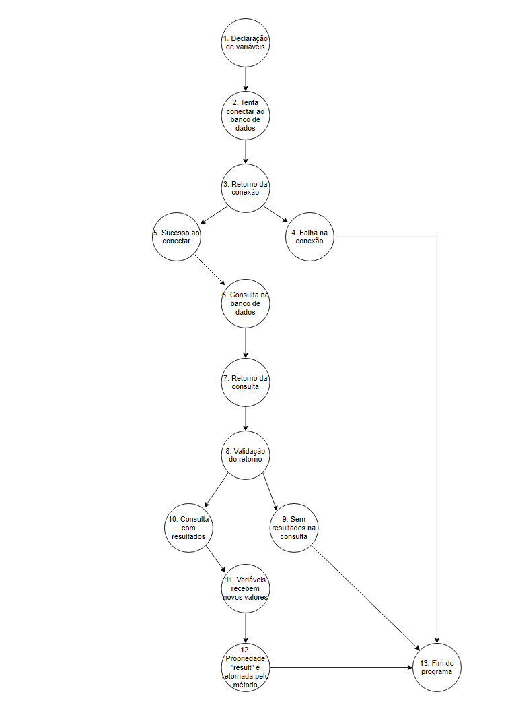

# Teste da Caixa Branca

Atividade realizada para a matéria "Qualidade e Testes de Software".

## Teste 2

### Grafo de Fluxo

### Complexidade ciclomática

<li>CC = (Arestas - Nós) + 2</li>
<li>(14 - 13) + 2</li>
<li>1 + 2</li>
<li>Complexidade Ciclomática = 3</li>

### Caminhos possíveis:

<li>Caminho 1 = 1, 2, 3, 4, 13.</li>
<li>Caminho 2 = 1, 2, 3, 5, 6, 7, 8, 9, 13.</li>
<li>Caminho 3 = 1, 2, 3, 5, 6, 7, 8, 10, 11, 12, 13.</li>
